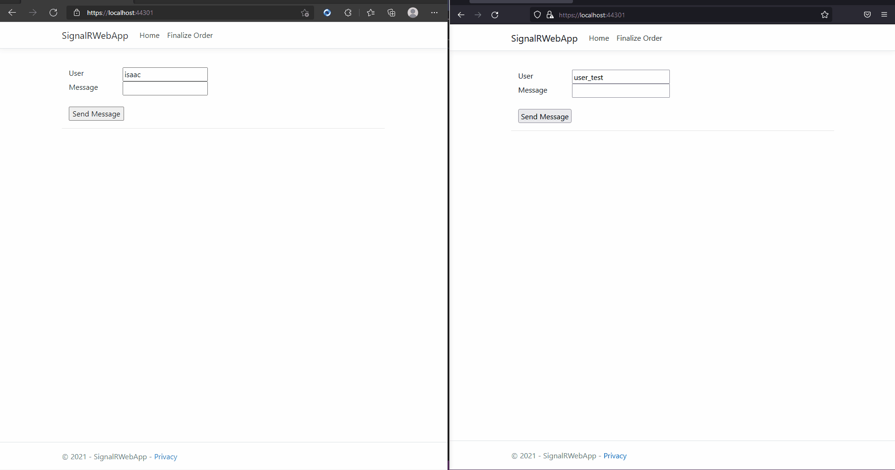
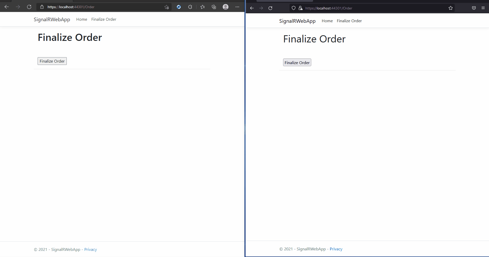

# SignalR Example

This is a sample project that demonstrates how [Signal R](https://dotnet.microsoft.com/apps/aspnet/signalr) can be used to create real-time applications.

## Project Dependencies 

- [.Net 5](https://dotnet.microsoft.com/download/dotnet/5.0)

### Chat example

### Order example
